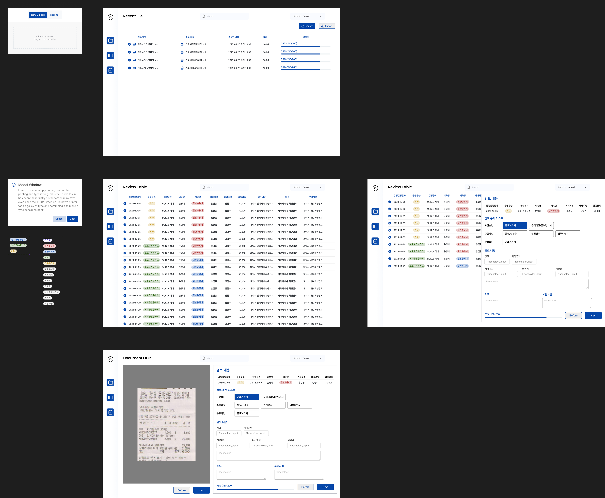

요구사항 분석부터 백엔드, 프론트엔드 그리고 UI 디자인까지 모두 맡아 프로젝트를 진행하면서 정말 즐겁고 재미를 느끼고 있다.

각 단계가 서로 유기적으로 연결되어 영향을 주고받는 과정을 직접 경험하며 많은 것을 배우고 있다.
어떻게 해야 개발에 도움이 되는 UI 디자인이 될지, 어떻게 API 요청을 보내야 효율적인지 등 직접 고민하고 개발하고 있다.

    AuditMate UI 디자인

이번에 선배에게 개발한 내용을 공유하면서, 요구사항을 분석할 때 어떤 방식이 좋은 분석인지에 대해 고민하게 되었다.

처음으로 90% 이상 개발된 결과물을 보여드리며 부족한 점에 대한 피드백을 받았는데, 너무 부가적인 기능들을 많이 넣었다는 것을 깨달았다.

    AuditMate 개발 점검 영상

내가 필요하다고 생각해서 개발하는 것보다, 사용자가 진짜 필요하다고 느끼는 기능을 만들어야 한다는 점을 다시금 되새기게 되었다.

선배 역시 프로젝트를 진행하면서 필요한 기능들을 정리하고, 이후 추가적으로 필요한 기능들을 고민하는 과정에서 계속 생각이 변해갔다고 한다.
그래서 이 프로젝트의 목적이 무엇인지에 다시금 이야기하고 정리하는 시간을 가졌다.

**"스피드"**, 즉 업무를 수행하는 속도를 높이는 것.

프로젝트를 시작한 이유를 되새기며, 현재 개발 단계에서 부족한 점은 무엇인지, 또 추가해야 할 부분은 무엇인지 함께 논의할 수 있었다.

단순히 기능을 구현하는 데에 그치지 않고, 진짜 필요한 것이 무엇인지 고민하면서 방향을 점검하는 시간이었다.

그 과정에서 내가 간과했던 부분들을 발견하기도 했고, 실사용자 입장에서 어떤 점들이 불편하거나 개선되었으면 하는지를 보다 구체적으로 들을 수 있었다.

이처럼 의뢰자와 가까운 위치에서 여러 번 만나며 피드백을 격의 없이 주고받을 수 있어 정말 좋은 경험을 하고 있는 것 같다.

